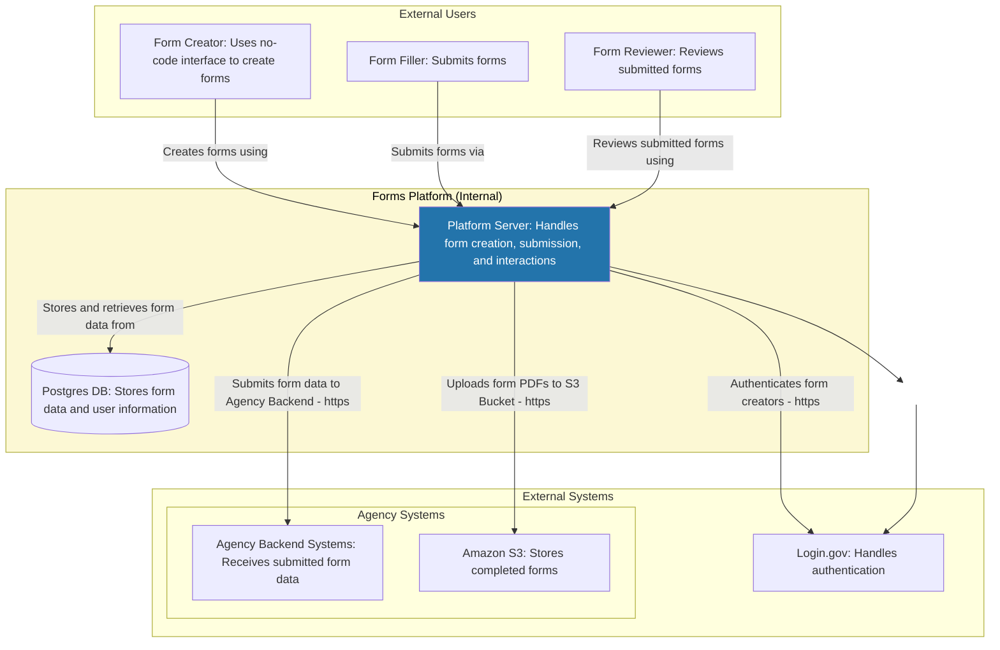

# Forms Platform architecture

## Overview

Forms Platform is organized into several packages:

| Package                        | Description                        | Dependencies                                                                                                                             |
| ------------------------------ | ---------------------------------- | ---------------------------------------------------------------------------------------------------------------------------------------- |
| [Forms](forms/README.md)       | Platform services and domain logic | [Common](common/README.md), [Database](database/README.md)                                                                               |
| [Server](server/README.md)     | Platform Node.js web server        | [Auth](auth/README.md), [Common](common/README.md), [Database](database/README.md), [Design](design/README.md), [Forms](forms/README.md) |
| [Design](design/README.md)     | User-facing interface components   | [Common](common/README.md), [Forms](forms/README.md)                                                                                     |
| [Auth](auth/README.md)         | Authentication and authorization   | [Common](common/README.md), [Database](database/README.md)                                                                               |
| [Common](common/README.md)     | Shared utilities                   | _None_                                                                                                                                   |
| [Database](database/README.md) | Backend storage                    | [Common](common/README.md)                                                                                                               |

## High-level architecture diagram

This C4-like architectural diagram documents data flows in a typical deployment scenario:

